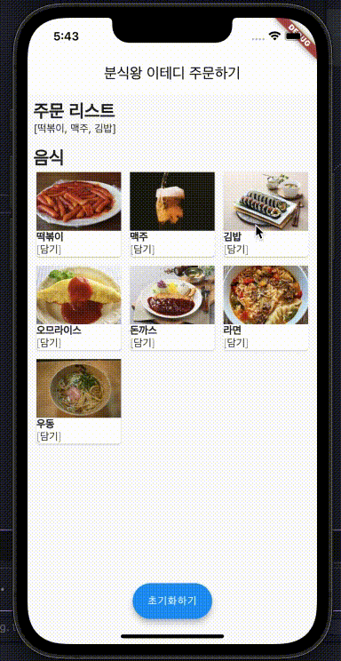

# assignment1

# 12일차 | 키오스크 앱 업그레이드 - 2

- **기존 과제내용은 다음과 같습니다. (Assets & Details)**
    
    [ 키오스크 앱 업그레이드](https://www.notion.so/f41fc8266dca4d7f8703f21921952162?pvs=21)
    

1. **기존의 키오스크 앱을 활용하여 다음의 결과물을 제작할 수 있도록 합니다.**
    
    
    

- 음식리스트는 다음의 API 주소에서 가져올 수 있습니다.
    - http://52.79.115.43:8090/api/collections/options/records
    - 속성값 items에 List<Map> 형태로 메뉴를 받아올 수 있습니다.
- 음식을 클릭하면, 주문리스트에 저장함과 동시에 앱 데이터에도 저장될 수 있도록 합니다.
- 주문 리스트의 Chip 의 삭제버튼을 누르면 앱 데이터에도 새로 저장될 수 있도록 합니다.
- 이 때, 앱 데이터를 저장하는 패키지는 **shared_preferences** 를 사용하여 해결합니다.
- **해당과제는 새로고침을 해도 주문리스트가 남아있는지가 핵심입니다.**