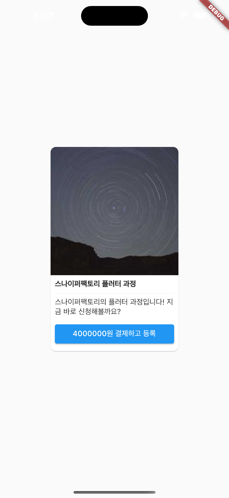
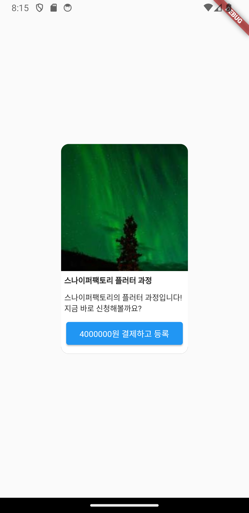

# assignment2

# 12일차 과제

과제 1. **다음의 URL에 네트워크 요청을 보내고, 얻은 데이터를 Class를 통해 생성할 수 있도록 만드시오.**

https://sniperfactory.com/sfac/http_json_data

- 이 때 제작하는 Class 명은 자유입니다.
- 받아온 네트워크 데이터를 Class에 적용시키고 플러터를 사용하여 다음의 화면을 제작합니다.

## result

