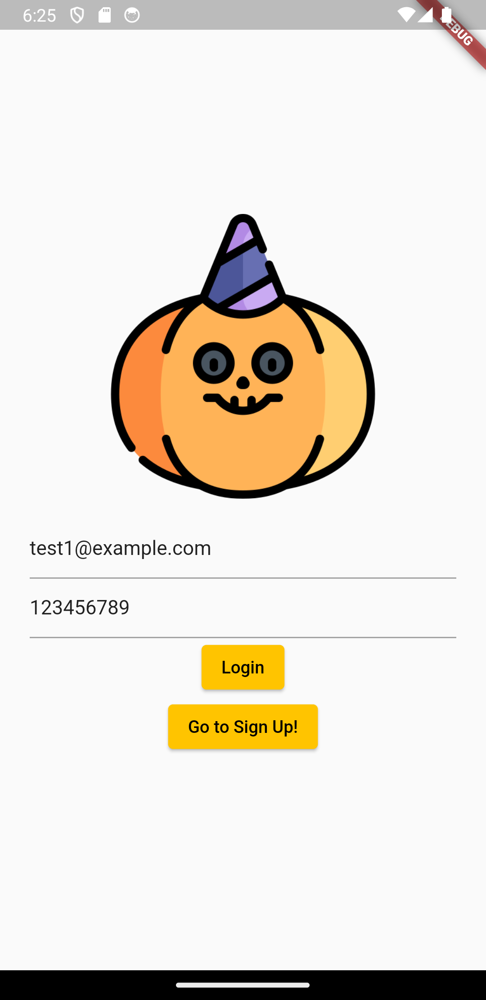
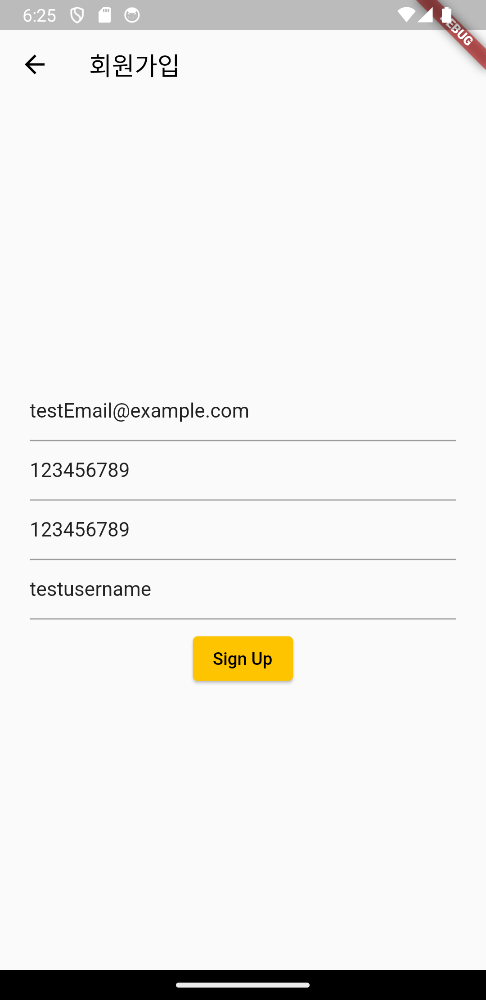
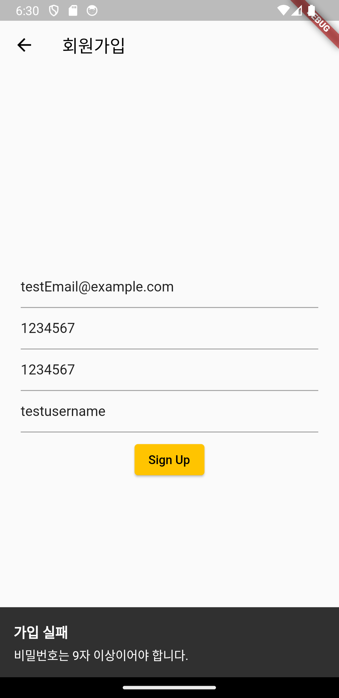
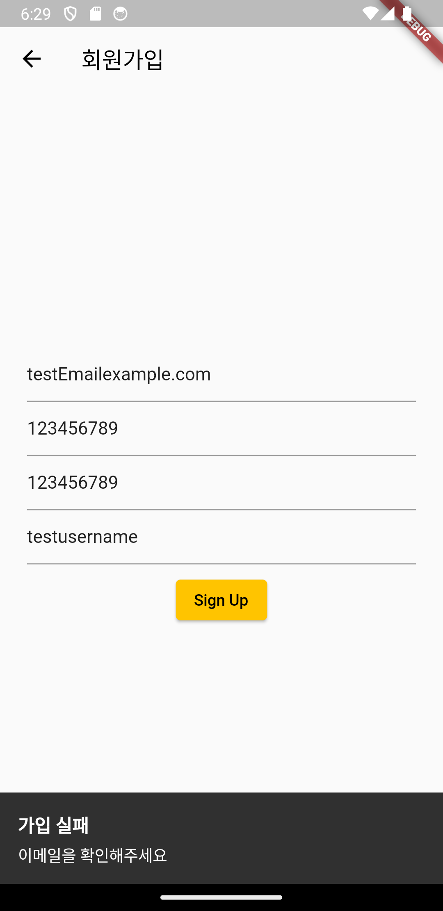
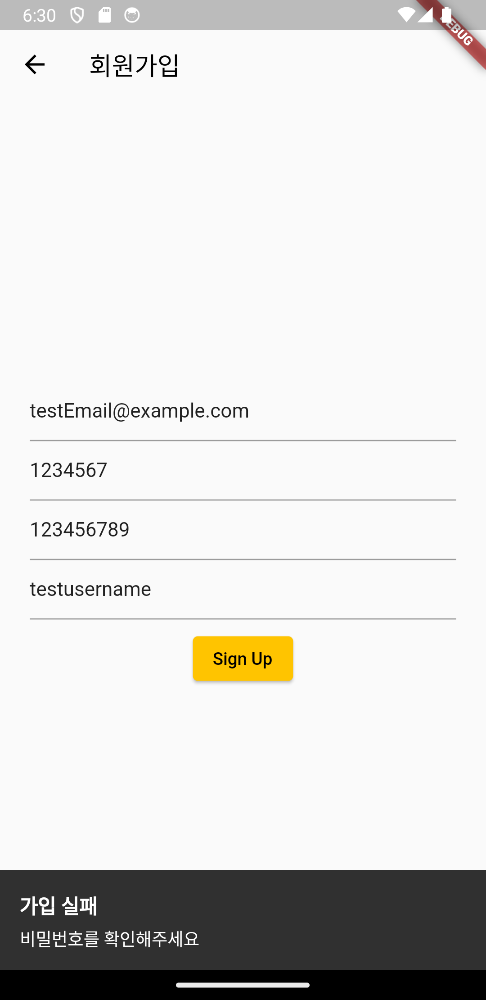
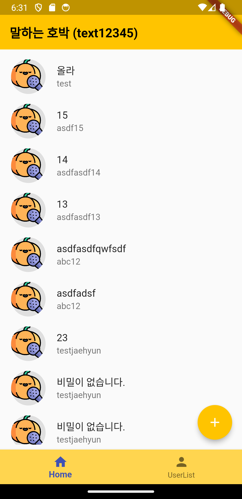
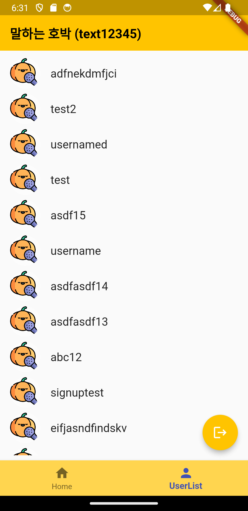
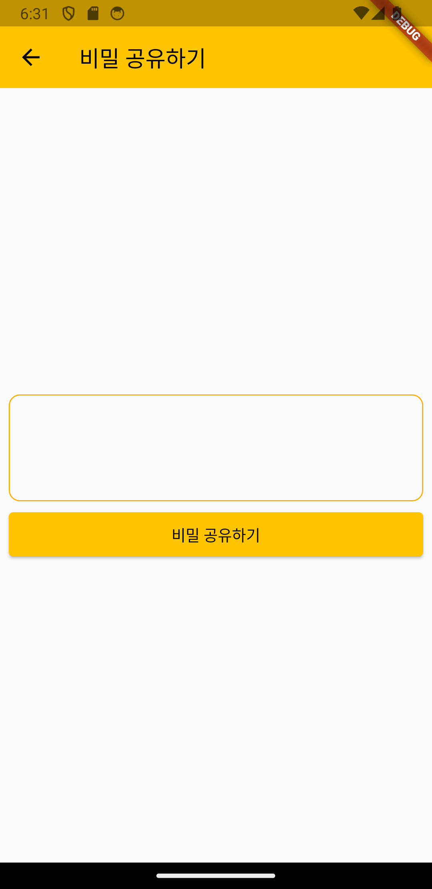

# assignment1

# 17일차 과제
## 구현 결과
### Title : 말하는 호박
|로그인<br>및<br>회원가입||||
|---|---|---|---|
|회원가입<br>실패 처리||||
|가입 및 로그인 성공|
|메인화면[비밀리스트, 회원리스트]||||
|FAB:비밀 공유(글쓰기)|


# Requirement
### 비밀듣는 고양이(최종)

---

1. 비밀듣는고양이를 secret_cat_sdk를 사용하지 않고 제작하시오.
2. 아래의 API 명세서를 보고, 플러터에서 과제풀이에 활용할 수 있도록 하시오.
3. 아래의 필수 기능을 포함해야 함.
    1. 로그인/회원가입 기능
    2. 유저 인증상태가 바뀌면 자동 페이지 리다이렉트 기능

---

# API명세서

# 👉 Users

### 📄 Read 유저리스트를 불러오는 기능

- **GET** http://52.79.115.43:8090/api/collections/users/records?sort=-created
- **Response**
    
    ```dart
    {
      "page": 1,
      "perPage": 30,
      "totalPages": 1,
      "totalItems": 2,
      "items": [
        {
          "id": "**USER_RECORD_ID** (주말과제시 필요)",
          "collectionId": "_pb_users_auth_",
          "collectionName": "users",
          "created": "2022-01-01 01:00:00Z",
          "updated": "2022-01-01 23:59:59Z",
          "username": "username123",
          "verified": false,
          "emailVisibility": true,
          "email": "test@example.com",
          "name": "test",
          "avatar": "filename.jpg"
        }
    	]
    }
    ```
    

### 📄 Login 로그인

- **POST** http://52.79.115.43:8090/api/collections/users/auth-with-password
- **Request**
    - identity (String - required)
    - password (String -required, 9글자 이상)
- **Success Response**
    
    ```dart
    {
      "token": "JWT_TOKEN",
      "record": {
        "id": "RECORD_ID",
        "collectionId": "_pb_users_auth_",
        "collectionName": "users",
        "created": "2022-01-01 01:00:00Z",
        "updated": "2022-01-01 23:59:59Z",
        "username": "username123",
        "verified": false,
        "emailVisibility": true,
        "email": "test@example.com",
        "name": "test",
        "avatar": "filename.jpg"
      }
    }
    ```
    

### 📄 **SignUp**  회원가입

- **POST** http://52.79.115.43:8090/api/collections/users/records
- **REQUEST**
    - email (String - required, 올바른 이메일형식일 것)
    - password (String - required, 9자 이상일 것)
    - passwordConfirm (String - required, 9자 이상일 것)
    - username (String)
- **Success Response**
    
    ```dart
    {
      "id": "RECORD_ID",
      "collectionId": "_pb_users_auth_",
      "collectionName": "users",
      "created": "2022-01-01 01:00:00Z",
      "updated": "2022-01-01 23:59:59Z",
      "username": "username123",
      "verified": false,
      "emailVisibility": true,
      "email": "test@example.com",
      "name": "test",
      "avatar": "filename.jpg"
    }
    ```
    

# 👉 Secrets

### 📄 Read 비밀리스트를 불러오는 기능

- **GET** http://52.79.115.43:8090/api/collections/secrets/records?sort=-created
- **Success Response**
    
    ```dart
    {
      "page": 1,
      "perPage": 30,
      "totalPages": 1,
      "totalItems": 2,
      "items": [
        {
          "id": "RECORD_ID",
          "collectionId": "5647cebjvtwtcu1",
          "collectionName": "secrets",
          "created": "2022-01-01 01:00:00Z",
          "updated": "2022-01-01 23:59:59Z",
          "secret": "test",
          "author": "RELATION_RECORD_ID",
    			"authorName": "test",
        }
      ]
    }
    ```
    

### 📄 Upload 비밀을 업로드하는 기능

- **POST** [http://52.79.115.43:8090/api/collections/secrets/record](http://52.79.115.43:8090/api/collections/secrets/records?sort=-created)s
- **Request**
    - secret (String)
    - author (String, (optional))
        - 해당 author는 User Record ID를 입력할 것
    - authorName (String, (optional))
        - 해당 authorName은 닉네임을 입력할 것
- **Success Response**
    
    ```dart
    {
      "id": "RECORD_ID",
      "collectionId": "5647cebjvtwtcu1",
      "collectionName": "secrets",
      "created": "2022-01-01 01:00:00Z",
      "updated": "2022-01-01 23:59:59Z",
      "secret": "test",
      "author": "RELATION_RECORD_ID",
    	"authorName":"test"
    }
    ```