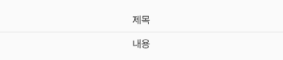

# Day2

### **과제 1.** **아래의 이미지와 동일한 결과물을 만들고, 이를 만들기 위한 전체 코드를 작성하세요.** 

- 3가지 이상의 기분을 담고있는 위젯을 페이징이 가능하게 만드세요. (gradient, radius 필수)
- **ListTile 위젯을 사용하지 않고**, 동일한 결과물을 만드세요.
    - 위와 아래를 구분하는 구분선은 **Divider** 위젯입니다.


```Dart
// 사용 예시
Column(
	children: [
		Text('제목'),
		Divider(),
		Text('내용'),
	]
)
```

<br>


