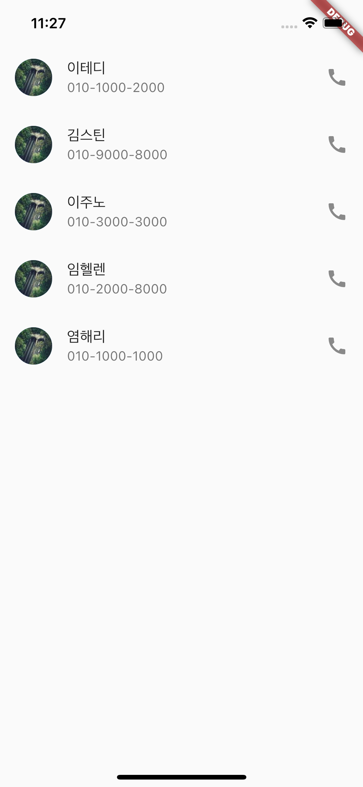

# assignment2
## 연락처 앱 기반 작성

1. 연락처에 저장될 친구들은 총 5명으로, 이름과 번호는 다음과 같다.

   - 이테디, 010-1000-2000

   - 김스틴, 010-9000-8000

   - 이주노, 010-3000-3000

   - 임헬렌, 010-2000-8000

   - 염해리, 010-1000-1000

2. 이미지는 네트워크로 (CDN 방식으로) 아래 URL에 랜덤이미지를 사용하세요.

   - https://picsum.photos/100/100

- 사용한 위젯은 다음과 같다. (다른위젯사용가능)

- Text, ListTile, Icon, Column, ???...

 

